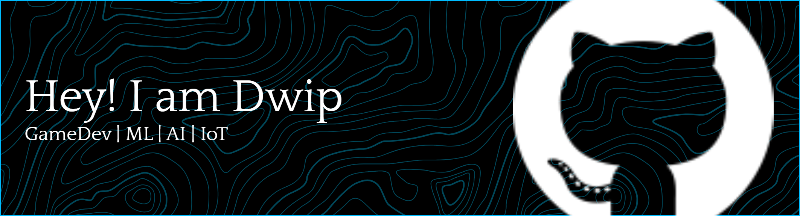

# hey, i'm dwip 👋

**`Computer Science Student @ UNNES`**

 

*A computer science student who loves exploring new things*
*From code to the mountaintop*

 

---

### 💫 About Me:
- 👨‍🦰My name is **Ismail Dwi**
- 🌏I'm from **Indonesia**
- 🏫I’m currently studying on **Semarang State University (UNNES)**
- 📚I’m currently learning **Game Developer**
- 😁My hobbies are **reading books, watching movies, hiking, and**

### 🌐 Socials:
  

### 💻 Tech Stack:
                 
### 📊 GitHub Stats:
 
 

<!-- ### 🏆 GitHub Trophies

### 🔝 Top Contributed Repo
 -->

<!-- Proudly created with GPRM ( https://gprm.itsvg.in ) -->

<!-- ## 🧍 About me
- 👨‍🦰My name is **Ismail Dwi**
- 🌏I'm from **Indonesia**
- 🏫I’m currently studying on **Semarang State University (UNNES)**
- 📚I’m currently learning **Game Developer**
- 😁My hobbies are **reading books, watching movies, hiking, and**

 
---

## 🛠️ Tech Stack

**Languages**

     

**Tools & Platforms**

  
  

---

## ⚙️ Github Stats

 -->